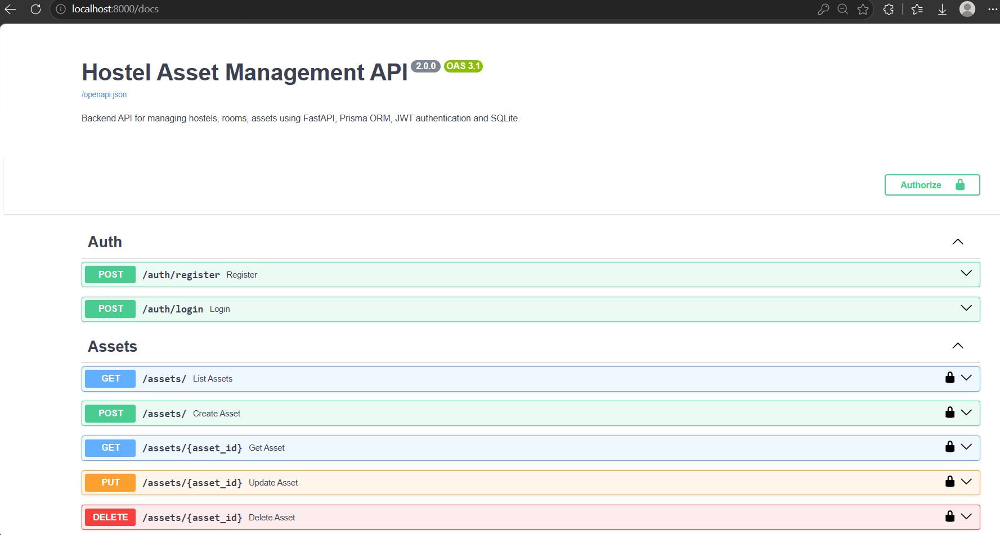
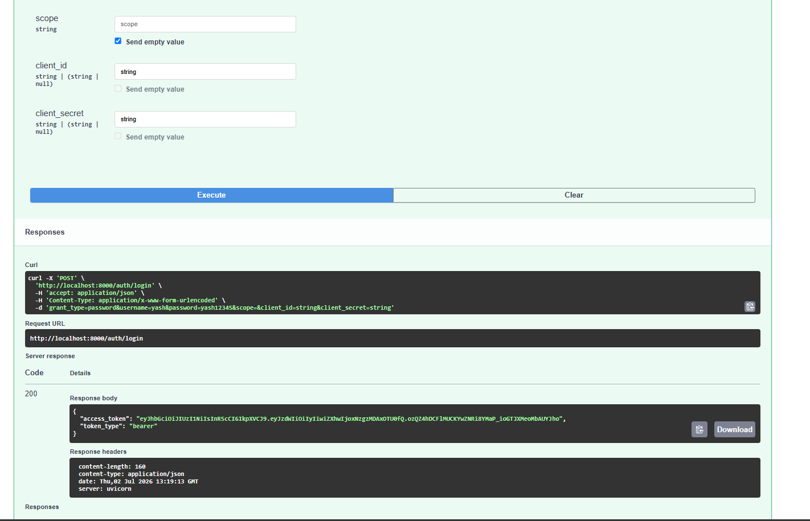
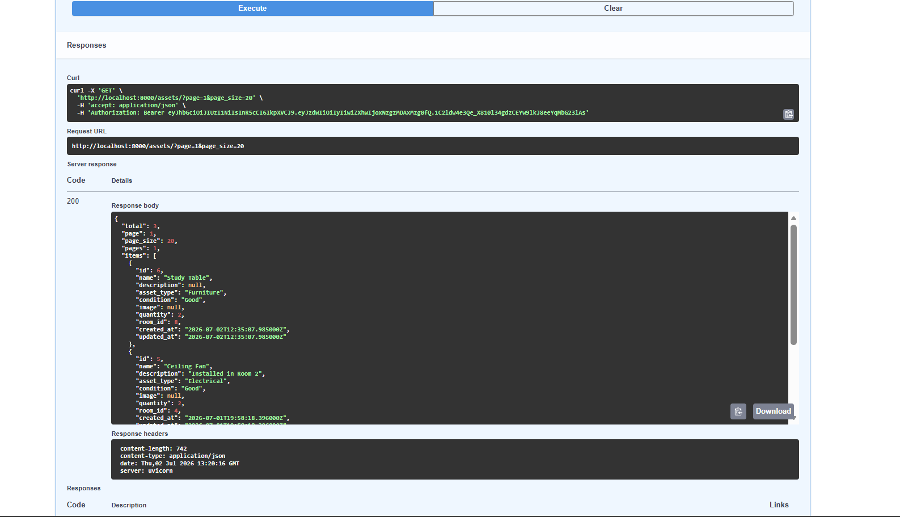

# Hostel Asset Management API


A RESTful backend API for managing hostels, rooms, and the assets assigned to
each room. Built with FastAPI, Prisma ORM, and SQLite, with JWT authentication
protecting all data-modifying endpoints.

This project demonstrates backend API development using FastAPI,
JWT authentication, Prisma ORM, and relational database design.

## Features

- JWT authentication (register / login)
- Hostel, room, and asset management with cascading deletes
- Complete CRUD operations for hostel assets, including quantity adjustment
- Paginated asset listing with search
- Interactive Swagger API documentation
- Dockerized setup with Docker Compose

## Tech Stack

- **Framework:** FastAPI
- **ORM:** Prisma (Python client)
- **Database:** SQLite
- **Authentication:** JWT (OAuth2 password flow)
- **Password hashing:** bcrypt (via passlib)
- **Containerization:** Docker + Docker Compose

## Architecture

```
Client
  │
  ▼
FastAPI (routers → schemas → business logic)
  │
  ▼
Prisma ORM
  │
  ▼
SQLite
```

## Data Model

```
Hostel (1) ──< Room (1) ──< Asset
```

- **Hostel** — a building/block. `name` is unique.
- **Room** — belongs to one hostel. `room_number` is unique per hostel.
- **Asset** — belongs to one room. Has a type, condition (defaults to "Good"), and quantity.
- Deleting a hostel cascades to its rooms; deleting a room cascades to its assets.

## API Endpoints

All endpoints except registration and login require a Bearer token
(obtained from `/auth/login`).

### Auth
| Method | Endpoint         | Description                          |
|--------|------------------|----------------------------------------|
| POST   | `/auth/register` | Create an account, returns a JWT       |
| POST   | `/auth/login`    | Log in (form-encoded credentials), returns a JWT |

### Hostels
| Method | Endpoint            | Description       |
|--------|---------------------|--------------------|
| GET    | `/hostels/`         | List all hostels   |
| POST   | `/hostels/`         | Create a hostel    |
| DELETE | `/hostels/{id}`     | Delete a hostel    |

### Rooms
| Method | Endpoint          | Description      |
|--------|-------------------|-------------------|
| GET    | `/rooms/`         | List all rooms    |
| POST   | `/rooms/`         | Create a room     |
| DELETE | `/rooms/{id}`     | Delete a room     |

### Assets
| Method | Endpoint                  | Description                              |
|--------|---------------------------|--------------------------------------------|
| GET    | `/assets/`                | List assets (paginated, optional search)  |
| POST   | `/assets/`                | Create an asset                            |
| GET    | `/assets/{id}`             | Retrieve a single asset                    |
| PUT    | `/assets/{id}`             | Update an asset                            |
| PATCH  | `/assets/{id}/quantity`    | Adjust quantity by a delta (+/-)          |
| DELETE | `/assets/{id}`             | Delete an asset                            |

Interactive API docs (Swagger) are available at `/docs` once the server is running.


## API Documentation

### Swagger Overview



### Authentication



### Asset Endpoints




## Getting Started

### Docker

```bash
git clone https://github.com/nnm77/hostel-assets-api.git
cd hostel-assets-api
cp .env.example .env
docker-compose up --build
```

The API will be available at `http://localhost:8000` (docs at `/docs`).

### Local (without Docker)

```bash
git clone https://github.com/nnm77/hostel-assets-api.git
cd hostel-assets-api
git checkout hostel-conversion
python -m venv venv
source venv/bin/activate      # Windows: venv\Scripts\activate
pip install -r requirements.txt
cp .env.example .env
prisma generate
prisma db push
uvicorn main:app --reload
```

### Environment Variables

See `.env.example` for the required variables:

| Variable | Description |
|---|---|
| `DATABASE_URL` | SQLite database file path |
| `SECRET_KEY` | Secret used to sign JWTs |
| `ACCESS_TOKEN_EXPIRE_MINUTES` | JWT expiry time |

## Testing

Automated tests are included using pytest and httpx.

```bash
pytest tests/ -v
'''

## Project Structure
'''


app/
├── core/
│   ├── database.py     # Prisma client instance
│   ├── security.py     # JWT creation/validation, password hashing
│   └── queue.py         # Background task queue (not currently integrated)
├── models/
│   └── schemas.py       # Pydantic request/response models
├── routers/
│   ├── auth.py
│   ├── hostels.py
│   ├── rooms.py
│   └── assets.py
main.py                  # FastAPI app setup and router registration
schema.prisma             # Database schema
tests/
├── test_api.py
└── conftest.py           # Test fixtures and isolated test database setup
```


## Future Improvements

- Maintenance request workflow
- Background task processing with Redis
- Role-based access control (Admin / Staff)
- PostgreSQL support for production deployment
- CI/CD pipeline with GitHub Actions

## Author

**Neema N Mudigere**

GitHub: https://github.com/nnm77